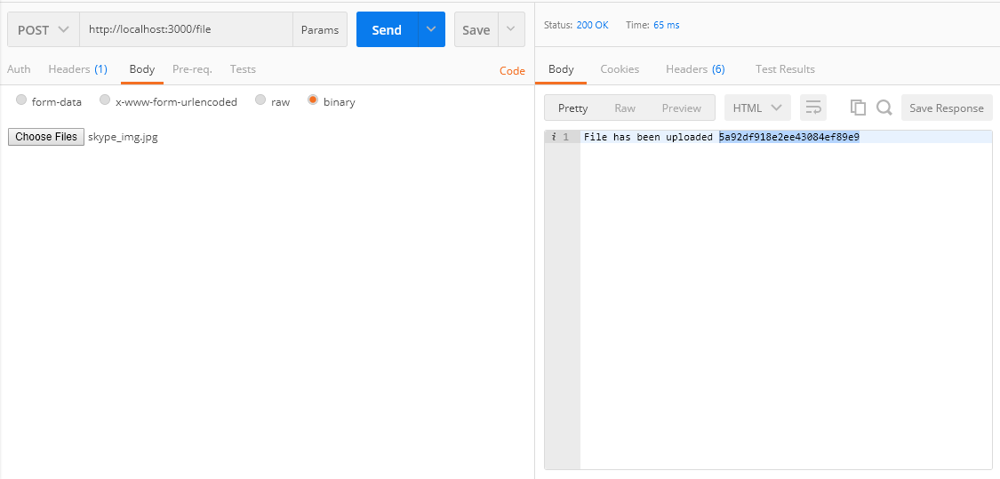

# Direct Upload via GridFS

### Node Server

Clone `direct_upload_gridfs` directory then run following:

> npm i express mongodb gridfs-stream

Now start server by following:

> node app.js

You should see following message:

> `All set! Start uploading :)`

##### Tip: Make sure mongodb server is running.

### Upload File

See screenshot:

### Download An Uploaded File

In upload api response you will get a unique id, use that id here:

e.g. open in browser: `http://localhost:3000/file/5a92df918e2ee43084ef89e9`
